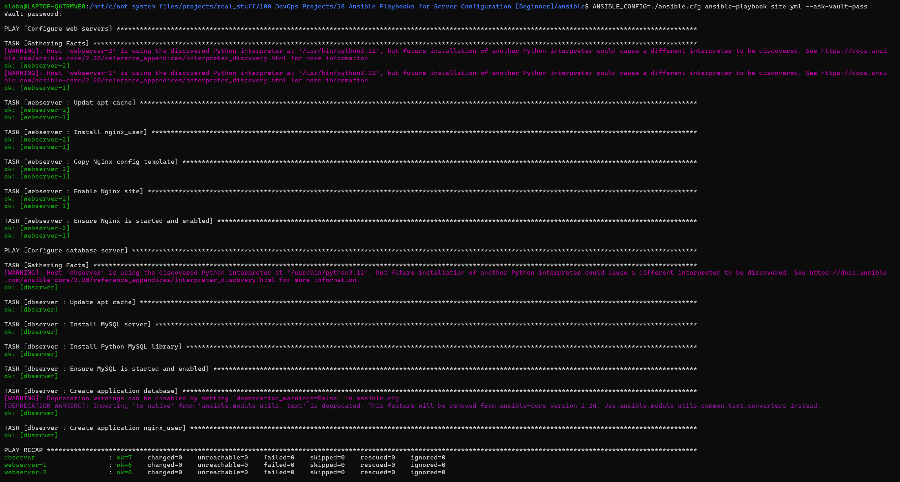
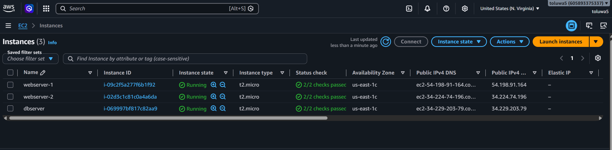
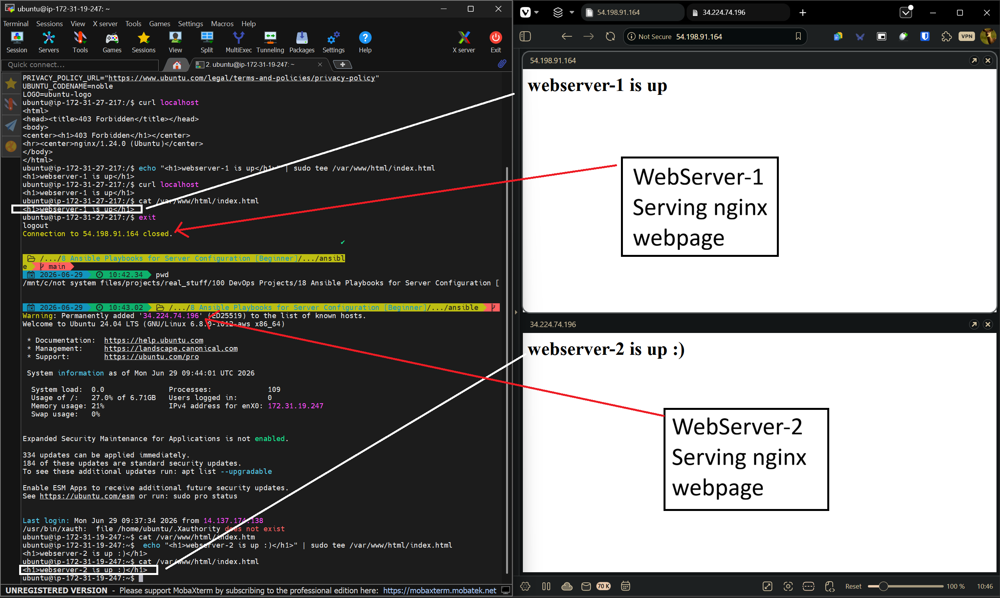
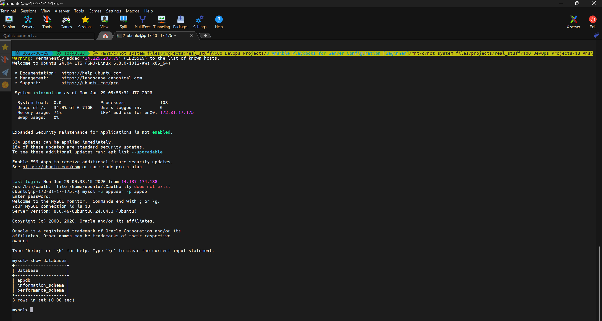

# Ansible Playbooks for Server Configuration

Ansible playbooks to configure and manage web servers and database servers across multiple hosts using roles, handlers, Jinja2 templates, and group variables.

## What This Does

Manual server configuration does not scale. When you have multiple servers to configure, doing it by hand means inconsistency, missed steps, and wasted time. This project automates the full configuration of two web servers and one database server using Ansible, so the same setup runs reliably across every host every time.

## What Gets Created

- Two Ubuntu web servers with Nginx installed and configured via a Jinja2 template
- One Ubuntu database server with MySQL installed, a dedicated database, and an application user
- Ansible roles separating webserver and dbserver logic cleanly
- Group variables driving server-specific configuration values
- Handlers restarting Nginx only when the config actually changes
- Ansible Vault encrypting sensitive database credentials

## Project Structure
ansible-server-configuration/

├── ansible.cfg
├── inventory.ini
├── site.yml
├── update_inventory.sh
├── group_vars/
│   ├── webservers.yml
│   └── dbservers.yml  (Vault encrypted)
└── roles/
├── webserver/
│   ├── tasks/main.yml
│   ├── handlers/main.yml
│   └── templates/nginx.conf.j2
└── dbserver/
└── tasks/main.yml

## Infrastructure

Three EC2 instances provisioned with Terraform before running Ansible:

- webserver-1 and webserver-2 — Ubuntu 22.04, t2.micro
- dbserver — Ubuntu 22.04, t2.micro

## How to Use

**1. Provision infrastructure**
```bash
cd terraform
terraform init
terraform apply
```

**2. Update inventory with new IPs**
```bash
bash update_inventory.sh
```

**3. Run the playbook**
```bash
cd ansible
ANSIBLE_CONFIG=./ansible.cfg ansible-playbook site.yml --ask-vault-pass
```

## Security Note

Database credentials in `group_vars/dbservers.yml` are encrypted with Ansible Vault. In this project the credentials are placeholder values for demonstration purposes. The vault password is required to run the playbook.

## Screenshots

### Ansible Playbook Output

<h3>All three servers configured with zero failures.</h3>

### EC2 Instances

<h3>webserver-1, webserver-2, and dbserver running in AWS.</h3>

### Nginx Servers

<h3>Both web servers serving pages over HTTP.</h3>

### MySQL Verification

<h3>Application database created and accessible with the app user.</h3>


## Tools
Ansible • Terraform • AWS EC2 • Ubuntu • Nginx • MySQL • Ansible Vault • Jinja2 • YAML • SSH